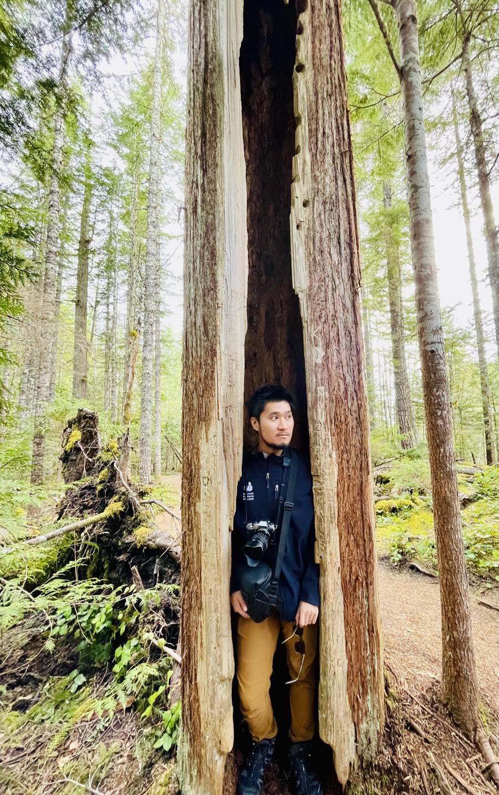

  

  

    

      I am a Simons Empire Assistant Professor in the Department of Physics and Astronomy at the
      <a href="https://www.pas.rochester.edu/people/faculty/zhang-yuanzhao/index.html" target="_blank" rel="noopener">University of Rochester</a>,
      where I lead the <a href="https://lab.y-zhang.com" target="_blank" rel="noopener">AID Lab</a>
      (AI &amp; Dynamics Group), working at the interface of complex networks, nonlinear
      dynamics, and machine learning.
      Before joining Rochester, I was an Omidyar Fellow at the Santa Fe Institute and a
      Schmidt Science Fellow at Cornell working with 
      <a href="https://www.stevenstrogatz.com" target="_blank" rel="noopener">Steven Strogatz</a>.
      I received my Ph.D. in Physics from Northwestern, advised by 
      <a href="https://dyn.phys.northwestern.edu/" target="_blank" rel="noopener">Adilson Motter</a>.
      You can reach me at 
      <a href="mailto:yuanzhao.zhang@rochester.edu">yuanzhao.zhang@rochester.edu</a>.
    

    

      <a href="https://lab.y-zhang.com" target="_blank" rel="noopener">AID Lab</a> &nbsp;·&nbsp;
      <a href="https://scholar.google.com/citations?user=xueImSMAAAAJ&hl=en" target="_blank" rel="noopener">Google Scholar</a> &nbsp;·&nbsp;
      <a href="https://orcid.org/0000-0002-2056-7755" target="_blank" rel="noopener">ORCID</a> &nbsp;·&nbsp;
      <a href="assets/cv.pdf" target="_blank" rel="noopener">CV</a> &nbsp;·&nbsp;
      <a href="https://github.com/y-z-zhang" target="_blank" rel="noopener">GitHub</a> &nbsp;·&nbsp;
      <a href="https://x.com/YuanzhaoZhang" target="_blank" rel="noopener">X</a>
    

    

      Broadly, I am interested in systems that exhibit rich emergent behaviors while remaining amenable 
      to theoretical analysis. Half jokingly, I like to say that I am into the
      simplest complex systems and not-too-nonlinear dynamics. Here are some of the questions
      currently keeping me awake at night:
    

  

    

      <strong>When and how can machine learning models extrapolate without physics?</strong>
      Incorporating physics into neural networks—symmetries, conservation laws, 
      and other inductive biases—is known to improve out-of-distribution generalization. 
      Yet many real-world complex systems lack fully understood or easily encoded physics. 
      Can machine learning models still extrapolate in such cases? 
      If so, what hidden inductive biases or implicit regularization are responsible? 
      By studying systems ranging from reservoir computers to time-series foundation models, 
      I hope to uncover the principles that enable physics-uninformed extrapolation in machine learning.
    

    

      <strong>How does global order emerge from local interactions?</strong>
      From fireflies spontaneously synchronizing their flashes to neurons generating avalanches
      of firing activity, nature is full of examples of order emerging without central control. 
      What mechanisms allow such global coordination to arise from local interactions?
      I study these systems by representing them as networks or hypergraphs of nonlinear nodes 
      and analyzing them through the lenses of dynamical systems and network theory. 
      How does network structure shape macroscopic behavior? 
      How do basins of attraction look in such high-dimensional nonlinear systems? 
      Insights from these questions can inform everything from designing neural networks that 
      navigate complex loss surfaces more effectively to developing strategies 
      that quickly restore disrupted circadian rhythms after long-haul flights.
    

  If these questions keep you up at night too, my group is recruiting PhD students,
  postdocs, and undergraduate researchers—see
  <a href="https://lab.y-zhang.com/join.html" target="_blank" rel="noopener">how to join the AID Lab</a>.

